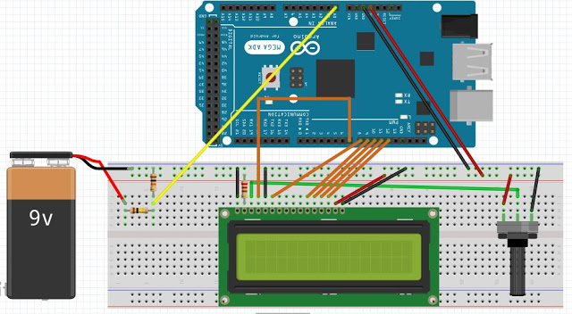

# CARGA DE LA BATERIA

## Componentes utilizados

* Placa Arduino
* Pantalla LCD de 2cms x 16 cms.
* Resistencias de 10k, 100k (Entrada de voltaje superior a 5V)
* Resistencia de 240 ohm(lcd).
* Protoboard
* Cables
____

*Figura 1, Diagrama de los componentes para la carga de la bateria*
