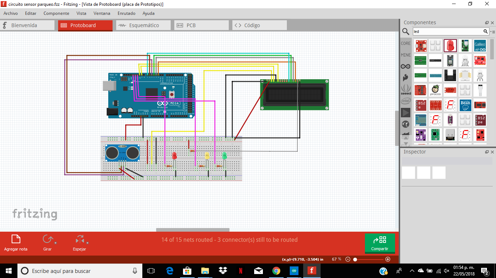

# SENSOR DE PARQUEO

* Placa Arduino
* Potenciometro de 10k
* Pantalla lcd
* Sensor ultrasónico
* Leds rojo, amarillo y verde.
* Resistencias de 240 ohm.
* Speaker
* Cables
* Protoboard
___


*Figura 2, Diagrama del sensor de parqueo*
___


## Codigo C++ 

```cpp

#include <LiquidCrystal.h>

LiquidCrystal lcd1 (9, 10, 7, 4, 3, 2);//rs,e,d4,d5,d6,d7
//voltimetro
LiquidCrystal lcd2 (52, 50, 48, 46, 44, 42);//rs,e,d4,d5,d6,d7

//voltimetro
int pin_lectura = A0;  
float voltaje_entrada;
float voltaje_final;
float resistencia1 = 100000; //Resistencia de 100K
float resistencia2 = 10000; //Resistencia de 10k

//parqueo
const int EchoPin = 5;
const int TriggerPin = 6;
const int LedPinVerde = 13;
const int LedPinAmarillo = 12;
const int LedPinRojo = 11;
float distancia;
long tiempo;//parqueo

void setup() {
  //sensor parqueo
  Serial.begin (9600);
  //numero de columnas y filas
  lcd1.begin(16,2);

 Serial.begin(9600);
  pinMode(LedPinVerde, OUTPUT);
  pinMode(LedPinAmarillo, OUTPUT);
  pinMode(LedPinRojo, OUTPUT);
  pinMode(TriggerPin, OUTPUT);
  pinMode(EchoPin, INPUT);

  //voltimetro
   pinMode(pin_lectura, INPUT);
  lcd2.begin(16, 2);

}

void loop() {
//parqueo
 digitalWrite(TriggerPin, HIGH);  //se envía un pulso para activar el sensor
  delayMicroseconds(10);
  digitalWrite(TriggerPin, LOW);

    tiempo = (pulseIn(EchoPin, HIGH)/2);
    distancia = float(tiempo * 0.0343); 

  lcd1.setCursor(0,0);
  lcd1.print("DISTANCIA PROX:");
  lcd1.setCursor(5,1);
  lcd1.print(distancia);
  delay(100);

  if (distancia >= 50) {
        digitalWrite(LedPinVerde , HIGH);
        digitalWrite(LedPinAmarillo , LOW);
        digitalWrite(LedPinRojo , LOW);
                      }
else if((distancia <= 49) && (distancia >= 16)){
        digitalWrite(LedPinVerde , LOW);
        digitalWrite(LedPinRojo , LOW);
        digitalWrite(LedPinAmarillo , HIGH);
       
}  
else if (distancia <=15) {
        digitalWrite(LedPinVerde , LOW);
        digitalWrite(LedPinAmarillo , LOW);
        digitalWrite(LedPinRojo , HIGH);
}  

delay(100);

//voltimetro
voltaje_entrada = (analogRead(A0)*4.95)/1024;  //Lee el voltaje de entrada
  voltaje_final = voltaje_entrada/(resistencia2/(resistencia1+resistencia2));  //Fórmula del divisor resistivo para el voltaje final

  lcd2.setCursor(0, 0);
  lcd2.print("CARGA BATERIA:");

  lcd2.setCursor(4, 1);
  lcd2.print(voltaje_final);  //Muestra el voltaje final
  delay(500);

  }
``` 
