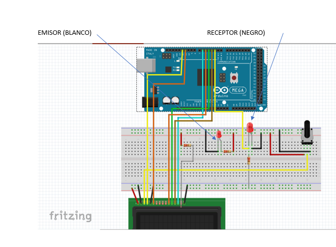

# REVOLUCIONES POR MINUTO (RPM)

## Componentes utilizados

* Placa Arduino
* Led emisor
* Led receptor
* Pantalla lcd 2x16
* Resistencias 240 ohm (pantalla lcd), 10k (emisor) 540ohm (receptor)
* Potenciómetro 10k
* Protoboard
* cables
___


*Figura 3, Diagrama del componente RPM*
___


## Codigo C++

```cpp

#include <LiquidCrystal.h>
volatile int contador =0;

const int rs =  12, en = 11, d4 = 5, d5 = 4, d6 = 3, d7 = 6;
LiquidCrystal lcd (rs, en , d4, d5, d6, d7);

void setup() {
 Serial.begin(57600);
 attachInterrupt(0,interrupcion0,RISING); //interrupcion 0 (pin 2)
 lcd.begin(16,2);
 }

void loop() {
  delay(999);
  lcd.setCursor(7,1);                                                                                                                                                                                                                                                            
  lcd.print(contador*30);
  lcd.setCursor(7,0);
  lcd.print("RPM");
  delay(500);
  contador=0;
}

void interrupcion0(){
  contador++;
}

``` 
