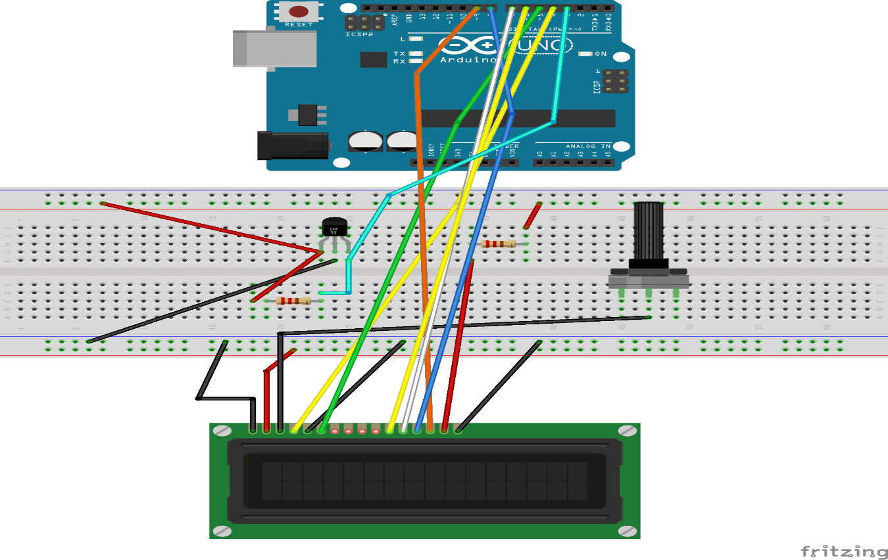

# VELOCIMETRO

## Componentes utilizados

* Placa Arduino.
* Pantalla lcd 2x16.
* Potenciómetro 10k.
* Resistencias 10k,  1k.
* Sensor *efecto hall*.
* Protoboard.
* Cables.

____


*Figura 4, Diagrama del velocimetro*

___


## Codigo C++
```cpp
#include <LiquidCrystal.h>
LiquidCrystal lcd(4, 5, 6, 7, 8 , 9);

int estadoActual1=0;
int estadoActual2=0;
int estadoUltimo=0;
int contador=0;
float radioEnCm=13.0;   //INGRESAR radio de la rueda en cm
float pi=3.1416;
float perimetroRueda=2*pi*(radioEnCm/100);  //Calcula Perimetro en metros
float distRecorrida=0;
float distKM=0;
int tiempo1=0;
int tiempo2=0;
int tiempo3=0;
float tiempo4=0;
float velocidad=0;

void setup(){
        pinMode(4,OUTPUT);
        pinMode(3,INPUT);
        Serial.begin(9600);
        lcd.begin(16,2);
}

void loop(){
        estadoActual1=digitalRead(3);
        delay(10);
        estadoActual2=digitalRead(3);
//Si los estados no son iguales, el sketch no hace gran cosa
        if (estadoActual1 == estadoActual2) {
              if (estadoActual1 != estadoUltimo){
                    if (estadoActual1 == HIGH) {
                        contador = contador + 1;
                        Serial.print ("Vueltas ");
                        Serial.println(contador);
                        distancia();
                        VEL();
                    }
              }
        }
        estadoUltimo= estadoActual1;
              
        if (contador%2 == 0 ) {
              digitalWrite(4, LOW);
        }
        else {
              digitalWrite(4, HIGH);
        }
        PantallaLCD();
}


void distancia(){
                        distRecorrida=perimetroRueda*contador;
                        distKM=distRecorrida/1000;
                        if(distRecorrida<=999){
                                Serial.print("Distancia recorrida en m= ");
                                Serial.println(distRecorrida);
                        }
                        else{
                                Serial.print("Distancia recorrida en Km= ");
                                Serial.println(distKM);
                        }
                        }

void VEL(){
        if (contador%2 == 0 ) {
              tiempo1=millis();
        }
        else {
              tiempo2=millis();
        }
        tiempo3=abs(tiempo2-tiempo1); //hay que pasar el tiempo a hrs
        tiempo4=(((tiempo3/1000.0)/60)/60);
        velocidad=((perimetroRueda/1000)/tiempo4);
        Serial.print("velocidad= ");
        Serial.println(velocidad);        
}


 void PantallaLCD(){
            lcd.clear();
            lcd.write("V=");
            lcd.print(velocidad);
            lcd.write("Km/h");
            lcd.setCursor(0,1);
                        if(distRecorrida<=999){
                                lcd.write("D=");
                                lcd.print(distRecorrida);
                                lcd.write("m");
                        }
                        else{
                                lcd.write("D=");
                                lcd.print(distKM);
                                lcd.write("Km");
                        }
            return;
                    lcd. clear();
}
```
